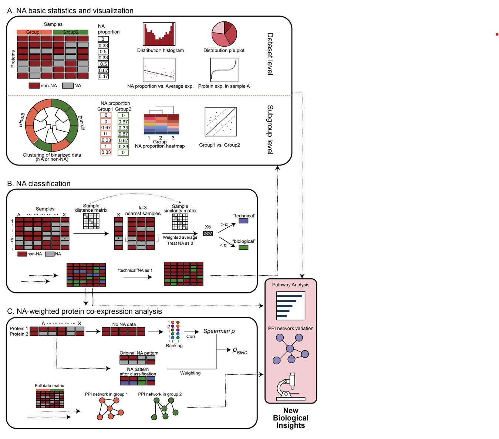

# BIND

BIND provides a useful tool for analyzing missing values(NAs) in a biological perspective.

It consists of 3 part, BIND_stat(A), BIND_classification(B), and BIND_ppi(C). The first one is BIND_stat, which works as a general statistical analysis of missing values in a proteomic dataset.



## BIND_stat

The input data are 2: expression matrix and group information.
There are 4 parameters,

---
**data_mtx_dir**: the expression data matrix file;

**grp_info_dir**: the group information file;

**grp_name**: the group type you tend to analysis, it must be one of the column names of grp_info file;

**output_dir**: analysis result output position;

---

A running example:

```
Rscript BIND_stat.R --data_mtx_dir "E:/EV_ML/raw_data/Batch_PPI/RDATA/Webserver/files/data.csv" --grp_info_dir "E:/EV_ML/raw_data/Batch_PPI/RDATA/Webserver/files/group_info.csv" --grp_name "Tissue" --output_dir "E:/EV_ML/raw_data/Batch_PPI/RDATA/Webserver/files/data.csv" --grp_info_dir "E:/EV_ML/raw_data/Batch_PPI/RDATA/Webserver/files/data.csv" --grp_info_dir "E:/EV_ML/raw_data/Batch_PPI/RDATA/Webserver/files/group_info.csv" --grp_name "Tissue" --output_dir "E:/EV_ML/raw_data/Batch_PPI/RDATA/Webserver/files/group_info.csv" --grp_name "Tissue" --output_dir "E:/EV_ML/raw_data/Batch_PPI/RDATA/Webserver/files/data.csv" --grp_info_dir "E:/EV_ML/raw_data/Batch_PPI/RDATA/Webserver/files/group_info.csv" --grp_name "Tissue" --output_dir "E:/EV_ML/raw_data/Batch_PPI/RDATA/Webserver/files/stat"
```

Output file:

**binary_mtx.csv**: A matrix after transfering the data marix with 1/0;

**overall_stat.csv**: overall NA ratio and statistics (missing value number / total sample number);

**group_stat.csv**: NA ratio by groups.

**img_pie.csv** file for creating a pie chart (see image description)

**img_grpvsnogrp_stat.csv** file for creating a group x-y scatter plot (see image description)

**img_grp_naproportion_tree.newick** tree file for clustering group_stat.csv

**img_binary_tree.newick** tree file for creating a clustering tree of binary_mtx (see image description)

## BIND_classification

BIND_classification provides an agrithom for classfying "biological" and "technical" NAs.
The input file is same with BIND_stat. There are 7 parameters:

---
**data_mtx_dir**: the expression data matrix file;

**grp_info_dir**: the group information file;

**grp_name**: the group type you tend to analysis, it must be one of the column names of grp_info file;

**output_dir**: analysis result output position;

**grp**: the specific group you interested in.

**k**: neighbour number of classification, an integer.

**th**: threshold for classfying NA type, an integer.

---


A running example:

```
RScript BIND_classification.R --data_mtx_dir "E:/EV_ML/raw_data/Batch_PPI/RDATA/Webserver/files/data.csv" --grp_info_dir "E:/EV_ML/raw_data/Batch_PPI/RDATA/Webserver/files/group_info.csv" --grp_name "Tissue" --output_dir "E:/EV_ML/raw_data/Batch_PPI/RDATA/Webserver/files/class" --grp "Breast" --k 5 --th 5
```

Output file:

**aftercalssification_label.csv**: a data matrix with NA labeled as "biological" or "technical", for user download, and for next stap analysis.

**aftercalssification_mtx.csv**: after transfering "biological"NA as 0 and "technical"NA as 0.5, other values as 1. This file for creating a heatmap.

**aftercalssification_groupmarkers.csv**: group specific markers found by BIND, for user download and creating a heatmap.

## BIND_ppi

BIND_ppi weighted the Spearman correlation analysis, by concerning NA in calculation. 

There are 9 parameters:

---
**data_mtx_dir**: the expression data matrix file;

**grp_info_dir**: the group information file;

**grp_name**: the group type you tend to analysis, it must be one of the column names of grp_info file;

**output_dir**: analysis result output position;

**grp**: the specific group you interested in.

**reward**: the reward of NA appears together, default 0.01.

**penalty**: the penalty of NA don't appear together, default 0.01.

**NAtype_mtx_dir**: the NA type matrix from BIND_classification's output file *aftercalssification_label.csv*

**protein_list_dir**: the protein list you interested in, .csv file with one column only. Prefer 20-100 proteins.

---

**9606protein_physical_v12.txt** is a provided human PPI database, which is used in this script, it should be put at same path of BIND_ppi.R.

User can specify a target group by using --grp, and get a group-specific BIND ppi. If --grp is not defined, BIND_ppi will cauculate based on the full data matrix.

Becuse calculating all protein pairs in the data matrix is too time-consuming, we can focus on user's interested proteins, by input a protein list (--protein_list_dir).

A running example:

```
RScript BIND_ppi.R --data_mtx_dir "E:/EV_ML/raw_data/Batch_PPI/RDATA/Webserver/files/data.csv" --grp_info_dir "E:/EV_ML/raw_data/Batch_PPI/RDATA/Webserver/files/group_info.csv"  --grp_name "Tissue"  --output_dir "E:/EV_ML/raw_data/Batch_PPI/RDATA/Webserver/files/ppi"  --reward 0.05 --penalty 0.05 --NAtype_mtx_dir "E:/EV_ML/raw_data/Batch_PPI/RDATA/Webserver/files/class/aftercalssification_label.csv"  --protein_list_dir "E:/EV_ML/raw_data/Batch_PPI/RDATA/Webserver/files/testpros.csv"
```

If --grp has been defined, the output are:

**BINDppi_groupdiff.csv**: Spearman rho(raw_raw in file), BIND_rho(weighted_rho in file) of both target group and other samples.

**BINDppi_groupdiff_filtered.csv**: After filtered by restricted conditions, it shows target group-specific ppi found by BIND(weighted_rho). Max 200 rows. This file for construct a ppi network.

If --grp has not been defined, the output are:

**BINDppi_withoutgroup.csv**: Spearman rho(raw_raw in file), BIND_rho(weighted_rho in file) of full matrix.

**BINDppi_withoutgroup_filtered.csv**: After filtered by restricted conditions, it shows specific ppi found by BIND compared with Spearman rho. 