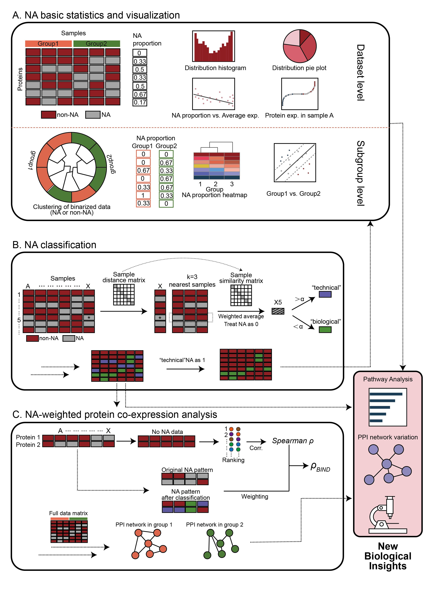
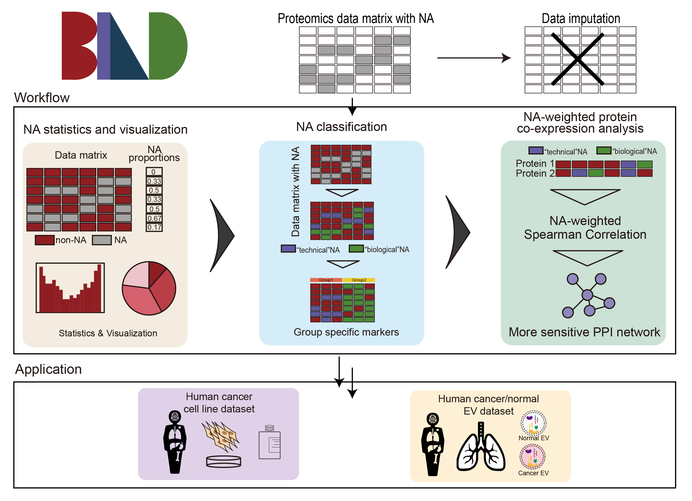

# Biological informative NA deconvolution (BIND)

## Brief introduction

BIND is a bioinformatics tool for comprehensive analysis of missing value patterns in large-scale proteomics data.

Although a variety of data imputation methods are available for imputing large-scale proteomics data containing missing values into complete data matrices, such manipulations typically ignore the biological significance of the missing values themselves. For example, missing values may arise from low or no protein expression, which BIND refers to as **“biological” NA**, or from technical problems, which BIND refers to as **“technical” NA**. BIND is designed precisely as a tool developed to derive biological insights from missing value patterns.

## Manuscript and citation

The BIND paper can be found at xxx.xxx.x. 

## BIND data analysis process

BIND analyzed the data from three perspectives:

- Characterization of missing value patterns in the dataset. This part analyzes the pattern of missing values in the dataset and the differences of missing values in different subgroups through various visualization methods, such as heatmaps, pie charts, etc.

- Classification of NAs. BIND differentiates “biological” from “technical” NAs by integrating features of neighboring samples. This deconvolves the NA natures and helps interpret the biological significance.

- NA-weighted protein interaction analysis. BIND generates weighting factors based on biological NAs to improve the abundance covariance analysis for more sensitive and precise mapping of protein complexes 

## Web server

We provide a website version of the BIND data analysis tool, which can be accessed by entering http://bind.fengslab.com/. The web page provides a detailed [user's tutorial](./Webserver).

## Sorce code and command line operation tool

In addition to the user-friendly web pages, we provide the [source code as well as command-line operation tools](./BINDscript) for those who want to explore BIND in depth.

## Figures

All [figures](./Figs) in the BIND paper are stored. Besides, [code](./Figs/Fig.R) for creating figures in the paper is also been uploaded.

## Contact

If you have any problem with BIND, please feel free to contact us. You may contact author directly by email to Guowh1999@outlook.com
