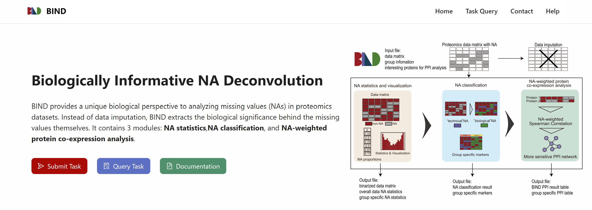
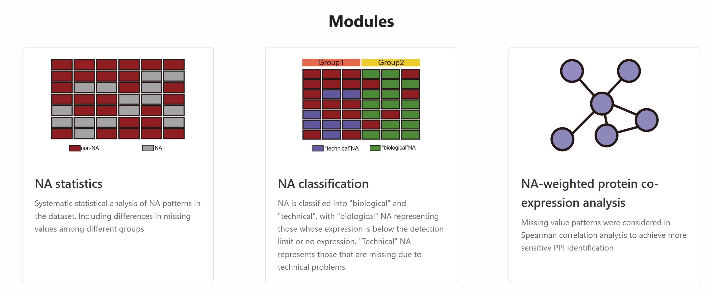
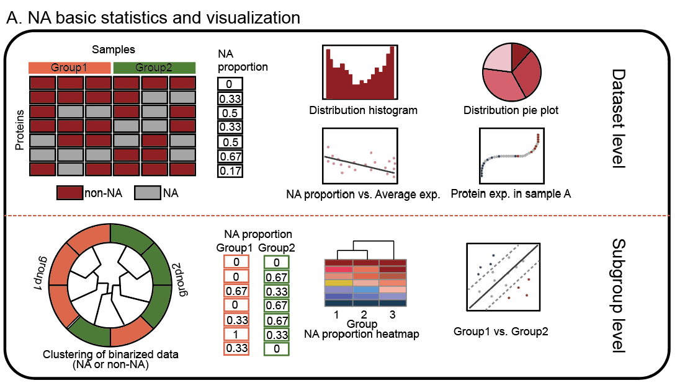
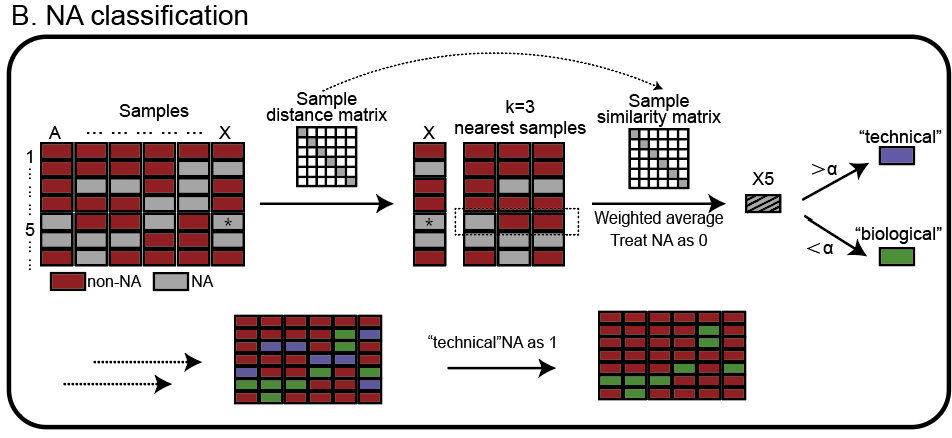
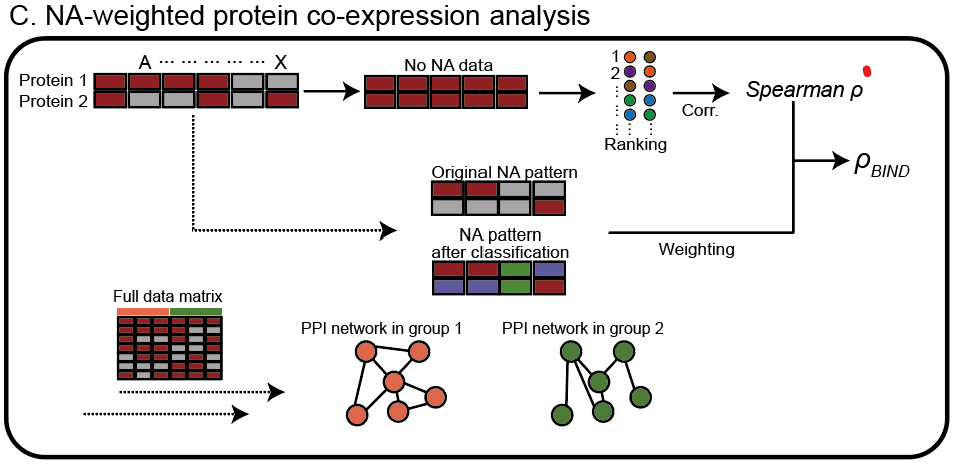

## 🧭 Introduction

Missing value problem is a difficult problem in omics data processing, especially in proteomics. Missing values can be divided into Missing completely at random(MCAR), Missing at random(MAR) and Missing not at random(MNAR). From a biological point of view, we can simplify it into two scenarios, the missing due to expression below the detection limit or no expression, called "biological" NA; the missing due to a technical problem is called a "technical" NA. The commonly used missing value imputation method fills the data set into a complete matrix, yet ignores the potential biological value of missing value. BIND systematically analyzes the biological value of missing values in proteomic data sets, focusing on the missing values themselves.

---

---

BIND is divided into three modules, the first module is the overall statistics, grouped statistics and visualization of NA in the data set. The second module implements the classification of NA, including "biological" and "technical" NA. The third module takes NA model into Spearman correlation analysis to get the optimized correlation coefficient. We applied BIND to human cancer cell lines and human extracellular vesicle(EV) datasets. BIND proved to have excellent performance in identifying protein markers and specific PPI.

---

---

## Calculation process of BIND

In the first module, BIND calculates the proportion of missing values for each protein in the dataset, as well as the proportion of missing values for proteins in the dataset separately by group. Multiple visualizations were used to discover proteins characterized by missing value patterns and group characterization.

  
In the second module, BIND implements NA classification. This is achieved by calculating the weighted average of the values of a protein in k neighboring samples to the sample in which the protein is located. A threshold value is used to distinguish between “biological” and “technical” NAs. Therefore, the parameters of this section include the number of neighbors k and the threshold value for distinguishing the category.

  
The third module performs NA-weighted protein co-expression analysis. The pattern of missing values, including the type of missing values obtained in the second module are used to weight the Spearman correlation coefficients. A reward is assigned to the correlation coefficient if both proteins are missing at the same time in a specific sample; a penalty is assigned if they are not missing at the same time. An additional reward is given if both missing proteins are “biological” NAs. The user needs to specify the coefficients for the reward and the penalty, which are both 0.01 by default.

