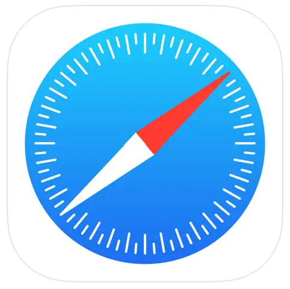

## 🌏 Software requirements

BIND requires a modern web browser with JavaScript enabled. Pop-ups must not be blocked to view the submission status of a job. The following browsers have been thoroughly tested with BIND:

 **Firefox**, version 5 or above([Download](https://www.mozilla.org/en-US/firefox/)); 

**Chrome**, version 9 or above([Download](https://www.google.com/intl/US/chrome/)); 

 **Safari**, version 5 or above([Download](http://www.apple.com/safari/download));  
                                                
 **Edge**, version X or above([Download](https://www.microsoft.com/en-us/edge/download?form=MA13FJ));

The latest version of Edge and Chrome is recommended for visualization.

Below are the detailed operation system and browser version we have tested that our website can operate successfully.

| OS | Version | Chrome | Firefox | Edge | Safari |
| --- | ---    |  ---   |  ---    | ---  | ---    |
| Windows | 11 |  131.0.6778.140 | 133.0.3 | 131.0.2903.99 | not applicable |
| Mac OS | Sequoia 15.0.1 | 131.0.6778.109 | 133.0.3 | 131.0.2903.99 | 18.0.1(20619.1.26.31.7) |
| Linux  | Ubuntu    |  131.0.6778.108  | 129.0.2 | 131.0.2903.99|   not applicable      |