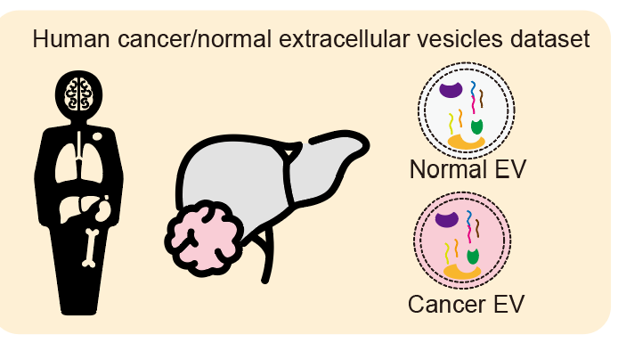

## 🧩Tutorials

  

We use 2 examples to help you explore the BIND.

| Example | Description |
| ---     |  ---        |
|Human cancer cell line| A dataset of human cancer cell lines. The dataset contains 100 cell line samples, from tissue of Haematopoietic and Lymphoid, Lung, Skin, etc.|
| Human cancer/normal EV | A dataset of human cancer and normal tissue extracellular vesicles. The EVs came from various types of cancer. |

 

**Example 1 Human cancer cell line**

**Example 2 Human cancer/normal EV**

Please refer to the Example1 & Example2 page for run example data.