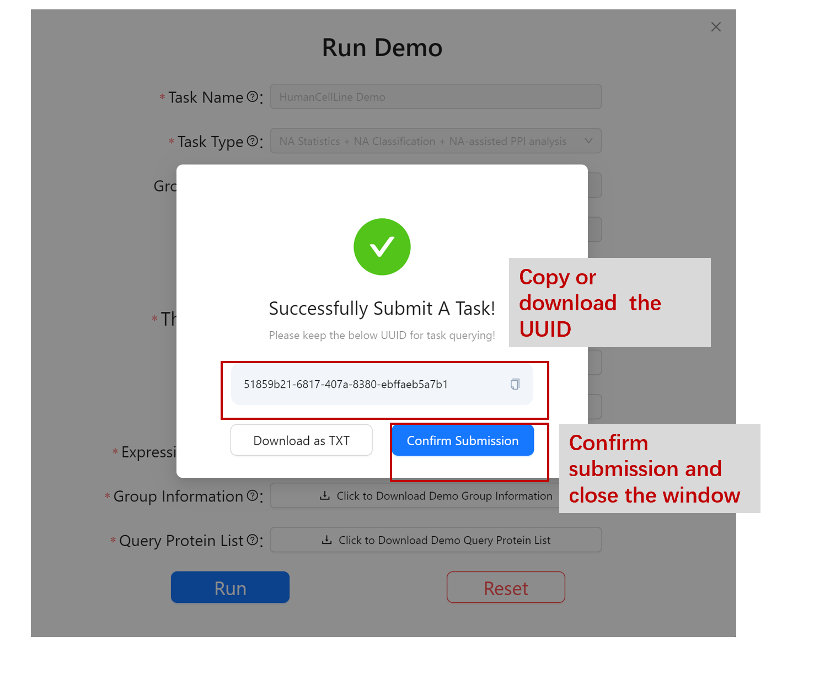
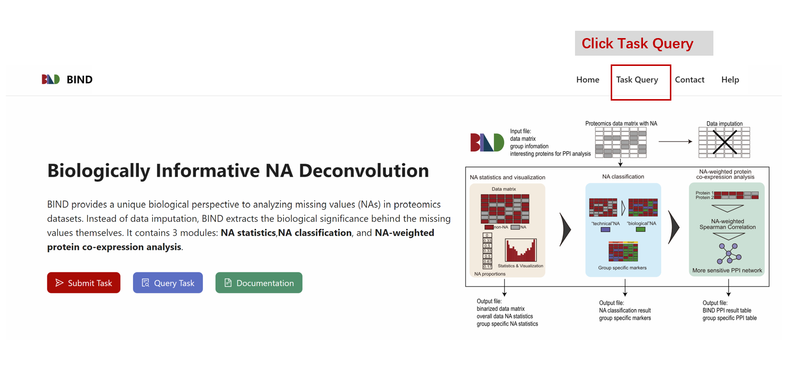
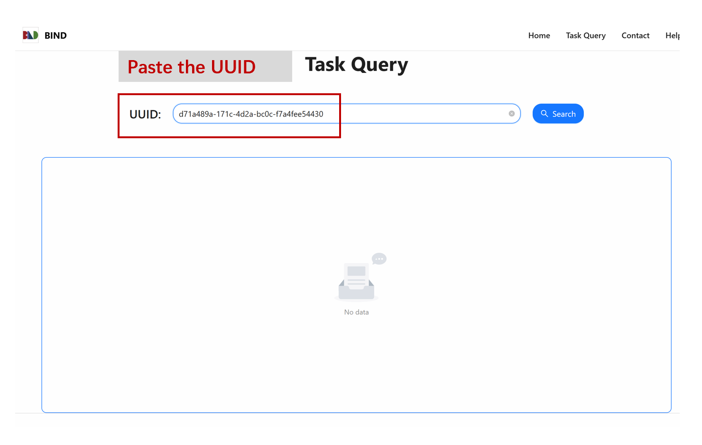
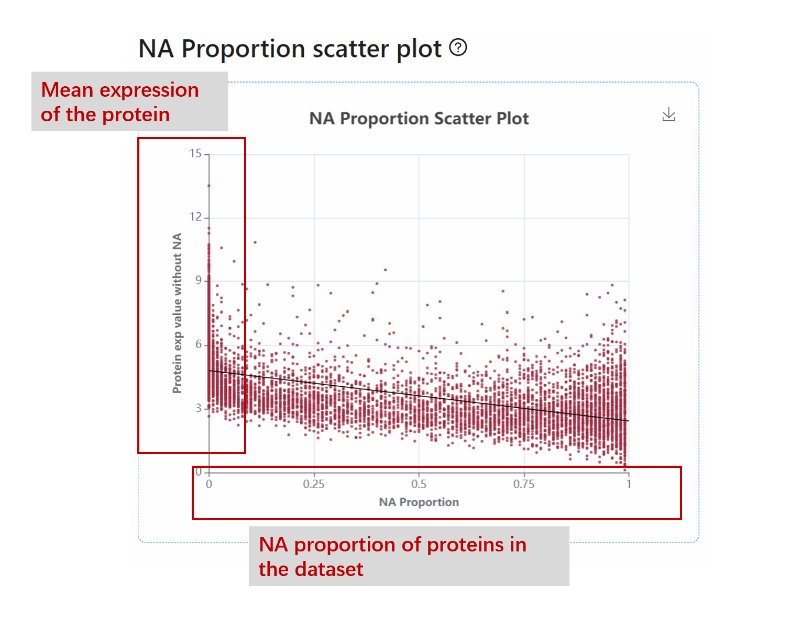
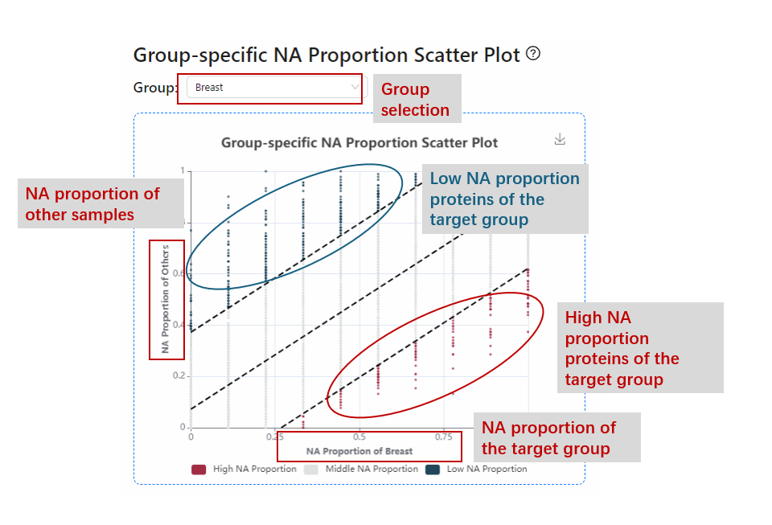
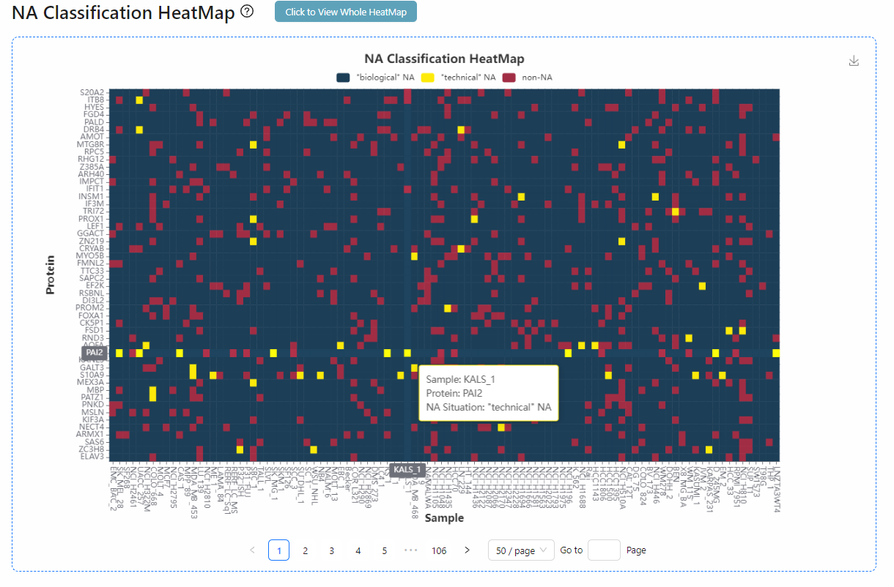
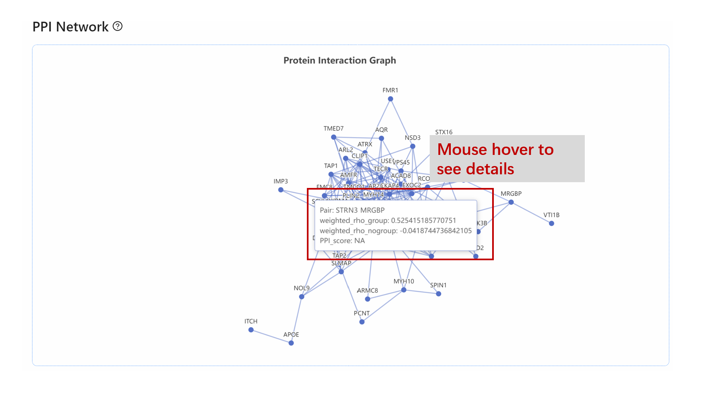

## 📊 Example 1

This example is a human cancer cell line dataset. Cell line samples come from different cancer tissues. BIND was used to analyze patterns of missing values in this dataset and to identify characteristic protein markers of haematopoietic and lymphoid cancers, as well as characteristic protein-protein interactions.

### Step 1: Loading data

Click ***Run HumanCellLine Demo***

### Step 2: Job submission

View Example data parameters / download example data files.

Click ***Run*** to run sample data.

Successfully submitted tasks will be given a UUID, please copy or download the UUID for the task query.

### Step 3: Job Query

Click ***Task Query*** on the top to query the submitted tasks.

Paste the UUID of your task. Click ***Search***

Get task information. If the task status is "running" or "pending", please wait until the task is completed. If the task status is "failed", please contact us.

Click ***View Task Detail*** after task completed

### Step 4: File download 

You can Download all output files on the Download Output Files page. See the Output explanation page for an explanation of the file.

### Step 5: Visualization results

**NA heatmap**
NA Heatmap is the missing value heatmap that visualizes the overall pattern of missing values. Red: values; Blue: NAs. The user can observe the overall pattern of missing values in the dataset.

**NA proportion histogram**

NA proportion histogram represents the distribution of NA proportions of different proteins in the dataset. The number of proteins with NA ratios near 0 or 1 is high in this dataset.
X axis: NA proportion
Y axis: Protein counts

**NA proportion pie chart**
NA proportion pie chart shows the pie chart of overall NA proportions (0 / 0-0.2 / 0.2-0.8 / 0.8-1).

**NA proportion scatter plot**
NA proportion scatter plot is an x-y scatter plot of NA proportions vs mean expression values of a protein. Linear regression results are provided. In this dataset, the proportion of NA was significantly negatively correlated with the average protein expression.
X axis: NA proportions in the dataset.
Y axis: Mean expression value of the proteins.

**Expression value with NA proportion label point plot**
Given a specific sample, ranking the protein expression values, label the overall NA proportion > 0.8/ <0.2/ 0.2-0.8 proteins by color.
X axis: proteins in the sample
Y axis: protein expression value
Red point: NA proportion > 0.8
Blue point: NA proportion < 0.2

**Group-specific NA proportion scatter plot**
x-y scatter plot of NA proportions in a specific group vs NA proportions in other groups.
X axis: NA proportions in the query group
Y axis: NA proportions in other samples

**Group level NA proportion heatmap**
Heatmap of NA proportions in different groups, clustering by samples. 

**NA classification heatmap**
Heatmap for values, "technical"NA and "biological"NA. Blue: "biological"NA; Yellow: "technical"NA; Red: expression value.

**NA classification group-specific marker heatmap**
Group markers heatmap is the specific markers of the haematopoietic and lymphoid cancer group. The same color mapping methods as the classification heatmap. As can be observed in the figure, BIND contributed to the improved identification of protein markers.

**BIND ppi network**
PPI network is a protein-protein interaction network. It shows the haematopoietic and lymphoid cancer-specific PPI found by ρBIND.

