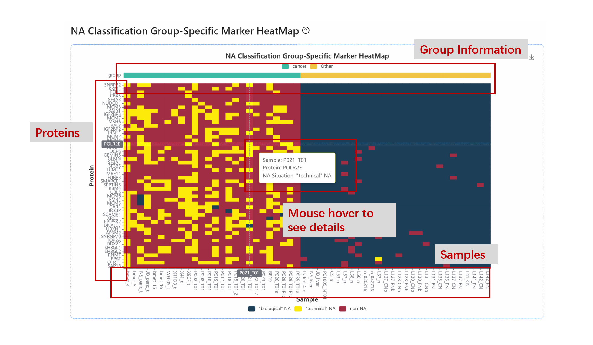

## 🧫Example 2

This example is an extracellular vesicle (EV) dataset in human cancer and normal tissue derived from a variety of solid tumor tissues. BIND analyzed the missing value composition of this dataset and enabled NA classification to identify cancer-specific protein markers. In addition, the interaction of cancer-specific proteins was identified, which provided a basis for related studies.

### Step 1: Loading data

Click ***Run HumanEV Demo***

### Step 2: Job submission

View Example data parameters / download example data files.

Click ***Run*** to run sample data.

### Step 3: Job Query

Successfully submitted tasks will be given a UUID, please copy or download the UUID for the task query.

Click ***Task Query*** on the top to query the submitted tasks.

Paste the UUID of your task. Click ***Search***

Get task information. If the task status is "running" or "pending", please wait until the task is completed. If the task status is "failed", please contact us.

Click ***View Task Detail*** after the task completed

### Step 4: File download

You can Download all output files on the Download Output Files page. See the Output explanation page for an explanation of the file.

### Step 5: Visualization results

**NA heatmap**
NA Heatmap is the missing value heatmap that visualizes the overall pattern of missing values. Red: values; Blue: NAs. The user can observe the overall pattern of missing values in the dataset.

**NA proportion histogram**
NA proportion histogram represents the distribution of NA proportions of different proteins in the dataset. Unlike Example1, the number of proteins in this dataset with NA ratios close to 1 is much larger than in the other cases.
X axis: NA proportion
Y axis: Protein counts

**NA proportion pie chart**
NA proportion pie chart shows the pie chart of overall NA proportions (0 / 0-0.2 / 0.2-0.8 / 0.8-1). The percentage of proteins with NA proportions of 0.8-1 was significantly higher in this dataset.

**NA proportion scatter plot**
NA proportion scatter plot is an x-y scatter plot of NA proportions vs mean expression values of a protein. Linear regression results are provided. In this dataset, the proportion of NA was also negatively correlated with the average protein expression.
X axis: NA proportions in the dataset.
Y axis: Mean expression value of the proteins.

**Expression value with NA proportion label point plot**
Given a specific sample, ranking the protein expression values, label the overall NA proportion > 0.8/ <0.2/ 0.2-0.8 proteins by color.
X axis: proteins in the sample
Y axis: protein expression value
Red point: NA proportion > 0.8
Blue point: NA proportion < 0.2

**Group-specific NA proportion scatter plot**
x-y scatter plot of NA proportions in a specific group vs NA proportions in other groups.
X axis: NA proportions in the query group
Y axis: NA proportions in other samples

**Group level NA proportion heatmap**
Heatmap of NA proportions in different groups, clustering by samples. 

**NA classification heatmap**
Heatmap for values, "technical"NA and "biological"NA. Blue: "biological"NA; Yellow: "technical"NA; Red: expression value.

**NA classification group-specific marker heatmap**
Group markers heatmap is the specific markers of the haematopoietic and lymphoid cancer group. The same color mapping methods as the classification heatmap. BIND identifies protein markers specific to EV in multiple cancer tissues.

**BIND ppi network**
PPI network is a protein-protein interaction network. It shows the cancerEV-specific PPI found by ρBIND.

