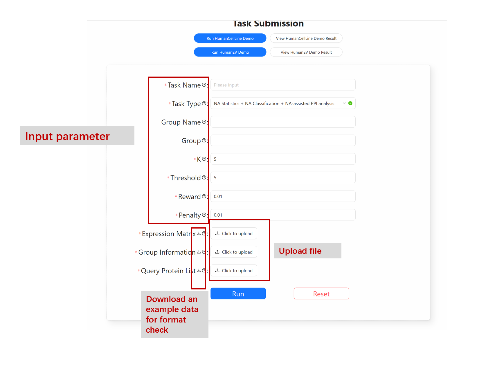
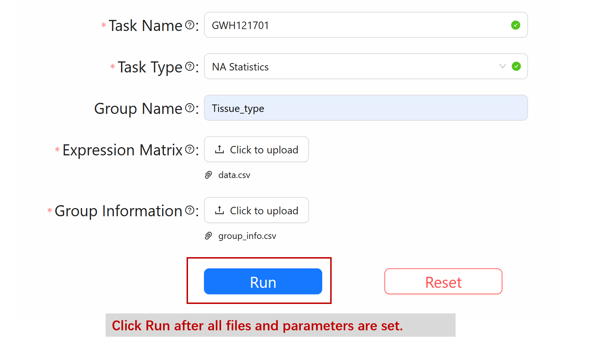
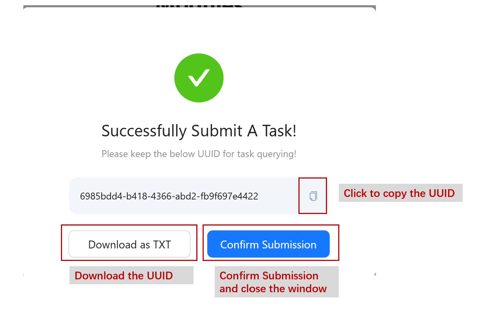
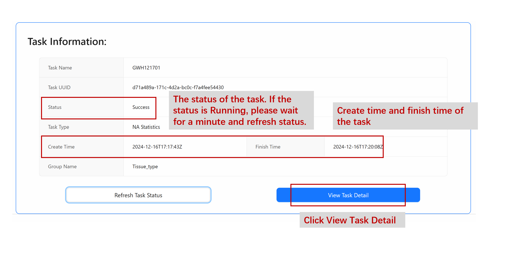

## 🗒️Submission guide

### Input form

### Input parameters

#### Mandatory files and parameters

| Parameter | Description |
| ---       | ---         |
| Task name |  User-specified name of the task. Each task should have a name. |
| Task type | There are 3 kinds of tasks, indicating 3 modules of BIND. Choose the module you want to run.|
| *Expression Matrix* | .csv, A protein matrix with protein expression value and missing values.|
| *Group Information* | .csv, Grouping information for each sample. The first column must be the sample name in the Expression Matrix.|

#### NA statistics
| Parameter | Description |
| ---       | ---         |
| Group_name | The column name in which you are interested in the Group Information file. |

#### NA classification
| Parameter | Description |
| ---       | ---         |
| Grp |  The specific group you are interested in. Eg. cancer |
| k   |  Neighbour number in NA classification step, an integer. Eg. 5 |
| th  |  Threshold for classifying NA type. Eg. 2.5 |

#### NA-assisted PPI analysis
| Parameter | Description |
| ---       | ---         |
| Grp |  The specific group you are interested in. Eg. cancer |
| reward | The reward parameter for simultaneously appeared NA. Eg. 0.01 |
| penalty   |  the penalty parameter for not simultaneously appearing NA. Eg. 0.01 |
| *Query Protein List*  |  .csv, only contains 1 column of the interested proteins for PPI analysis. The proteins should all be in the row names of ***Expression Matrix***. No column name is needed. |

### Input file format

***Expression Matrix*** with missing values:

|          | Sample1 | Sample2 | Sample3 | Sample4| ... |
| ---      | ---     | ---     | ---     | ---    | --- |
| Protein1 | 5.5     | NA      | 3.2     | 7.6    | ... |
| Protein2 | NA      | NA      | 3.1     | 8.5    | ... |
| Protein3 | NA      | 2.0     | 4.3     | NA     | ... |
| Protein4 | 3.2     | 9.0     | NA      | NA     | ... |
| ...      | ...     |  ...    | ...     | ...    | ... |

---
Tips:

* Columns are samples and rows are proteins.
* The sample names and protein names should not contain special characters, like: . , - —— [ { ( etc. Underline _ is acceptable where it is unavoidable.
* The sample names and protein names should start with an alphabet, such as A549, HeLa, HCT116... and EGFR, CXCR4, ...
* Official gene symbol is strongly recommended. In any case, we recommend that users pre-convert the protein name to official gene symbols if they are not.
* Protein expression values should be log converted.
* The total size limit of uploaded files is 50MB.
---

***Group Information*** of samples:

| Sample  | Grouptype1 | Grouptype2 | ... |
| ---     | ---        | ---        | --- |
| Sample1 | lung       | cancer     | ... |
| Sample2 | lung       | normal     | ... |
| Sample3 | stomach    | normal     | ... |
| Sample4 | skin       | cancer     | ... |
| ...     | ...        | ...        | ... |

---
Tips:

* Sample names should be in the first column, the order is recommended to match with column names in the expression matrix.
* There may be multiple columns to indicate multiple kinds of grouping, while each column should have a unique and easily distinguishable name.
* Each data in this table also should meet the requirements of the sample name.
---

### Submit the task

You will get a notice of successful submission.

### Check status & view results

If the status is Failed, please check if the uploaded files meet the requirement. If you confirm that there is no problem with the uploaded file, please contact us.