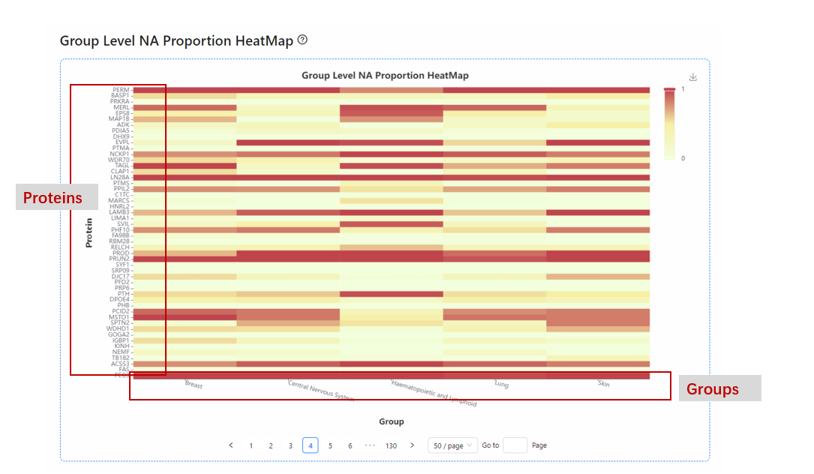

## ⬇️Output explanation

### Figures explanation

#### NA statistics
**NA heatmap**
The missing value heatmap visualizes the overall pattern of missing values. It came from the *binary_matrix.csv*. Red: values; Blue: NAs.

  

**NA proportion histogram**
NA proportion histogram represents the distribution of NA proportions of different proteins in the dataset. 
X axis: NA proportion
Y axis: Protein counts

**NA proportion pie chart**
Pie chart of overall NA proportions (0 / 0-0.2 / 0.2-0.8 / 0.8-1). Hover over to see the counts.

**NA proportion scatter plot**
x-y scatter plot of NA proportions vs mean expression values of a protein. Linear regression results are provided.
X axis: NA proportions in the dataset.
Y axis: Mean expression value of the proteins.

**Expression value with NA proportion label point plot**
Given a specific sample, ranking the protein expression values, label the overall NA proportion > 0.8/ <0.2/ 0.2-0.8 proteins by color.
X axis: proteins in the sample
Y axis: protein expression value
Red point: NA proportion > 0.8
Blue point: NA proportion < 0.2

**Group-specific NA proportion scatter plot**
x-y scatter plot of NA proportions in a specific group vs NA proportions in other groups.
X axis: NA proportions in the query group
Y axis: NA proportions in other samples

**Group level NA proportion heatmap**
Heatmap of NA proportions in different groups, clustering by samples. 

#### NA statistics

**NA classification heatmap**
A heatmap for values, "technical"NA and "biological"NA. Blue: "biological"NA; Yellow: "technical"NA; Red: expression value.

**NA classification group-specific marker heatmap**
The specific markers of the user-interested group, data from *aftercalssification_groupmarkers.csv*. The same color mapping methods as the classification heatmap.

#### NA-assisted PPI analysis

**BIND ppi network**

A protein-protein interaction network. It shows the group-specific PPI found by ρBIND(**Group** has been defined), or the specific PPI found by BIND compared with Spearman ρ (**Group** has not been defined). Hover over to see the exact values.

  

### Files for user download

### Files explaination

#### NA statistics

| Output file | Description |
| ---       | ---         |
| **binary_mtx.csv** |  A matrix after transferring the data matrix with 1/0. |
| **overall_stat.csv** | Overall NA proportions and statistics (missing value number / total sample number).|
| **group_stat.csv** | NA proportions by groups.|

 

**binary_mtx.csv**

**overall_stat.csv**

**group_stat.csv**

#### NA classification

| Output file | Description |
| ---         | ---         |
| **aftercalssification_label.csv** |  A data matrix with NA labeled as "biological" or "technical", for user download, and for next step analysis. |
| **aftercalssification_groupmarkers.csv** | Group-specific markers found by BIND, with the "biological"NAs replaced by 0, "technical"NAs replaced by 0.5 for convenient analysis. The expression values are 1.|
| **group_stat.csv** | NA proportions by groups.|

 

**aftercalssification_label.csv**

**aftercalssification_groupmarkers.csv**

#### NA-assisted PPI analysis

If **Grp** and **Group_name** have been defined, the output is:

| Output file | Description |
| ---         | ---         |
| **BINDppi_groupdiff.csv** |  Spearman ρ(raw_raw in the file), ρBIND(weighted_rho in file) of both target group and other samples. |
| **BINDppi_groupdiff_filtered.csv** | After filtering by restricted conditions, it shows target group-specific ppi found by BIND(weighted_rho). Max 200 rows. This file is for constructing a PPI network.|

 

If **Grp** and **Group_name** have not been defined, the output is:

| Output file | Description |
| ---         | ---         |
| **BINDppi_groupdiff.csv** |  Spearman ρ(raw_raw in the file), ρBIND(weighted_rho in the file) by all samples. |
| **BINDppi_groupdiff_filtered.csv** |  After filtering by restricted conditions, it shows specific PPI found by BIND compared with Spearman ρ.|

 

**BINDppi_groupdiff.csv** and **BINDppi_groupdiff_filtered.csv**

 
 

**BINDppi_withoutgroup.csv** and **BINDppi_withoutgroup_filtered.csv**

